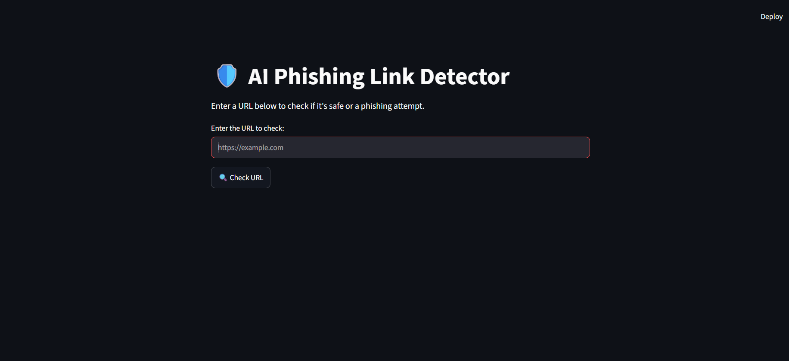
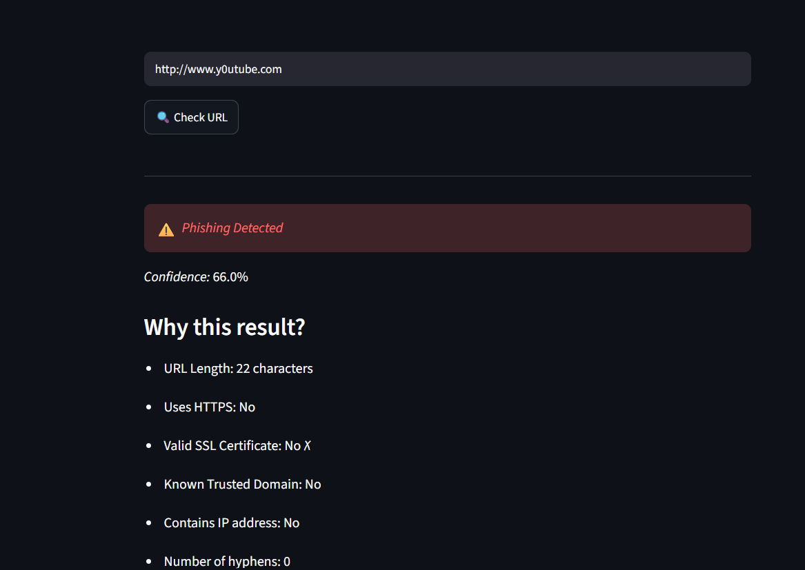
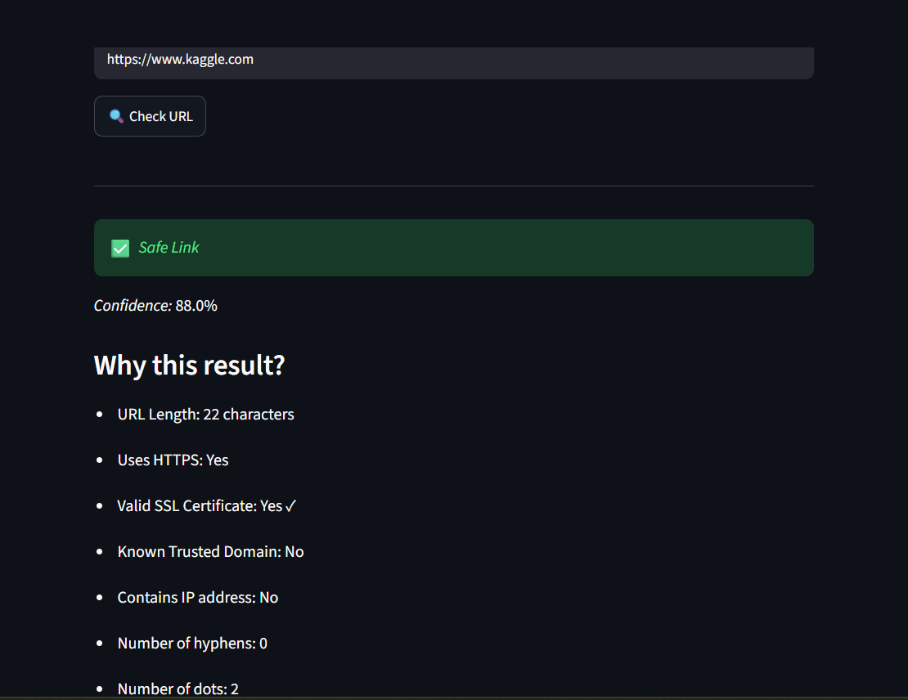

# Phishing Link Detector

A machine learning project that detects whether a URL is phishing or legitimate. Built this to practice applying ML to a real cybersecurity problem, with a simple dashboard where you can test a link and see the prediction.

## What it does

Takes a URL, extracts features from it, and uses a trained model to classify it as phishing or legitimate.

## Project files

- `01_load_explore.py` - loading the dataset and exploring it
- `02_preprocess.py` - cleaning/preprocessing the data
- `05_simplify_features.py` - narrowing down which features actually matter
- `03_train_models.py` - training and evaluating the models
- `04_dashboard.py` - the dashboard where you enter a URL and get a prediction

The trained model and encoders (`best_model.pkl`, `feature_columns.pkl`, `label_encoder.pkl`) are saved so the dashboard doesn't need to retrain every time.

## Tech used

- Python
- scikit-learn
- pandas / numpy
- [dashboard library - Streamlit/Flask/whatever you used]

## Screenshots

### Home page

### Phishing link result

### Legitimate link result

## Notes / what I'd improve

- Bigger dataset would help generalization
- Want to try comparing more models
- Could turn this into a browser extension eventually

---
Malak Alharbi 
[LinkedIn](https://www.linkedin.com/in/malak-alharbi-is)
